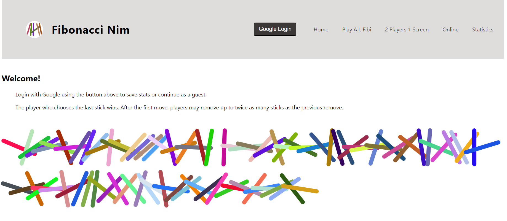

# fibonacci-web-app:
My self assigned final project after completing my NodeJs class to demonstrate learning how to create a backend including: sockets, server, CI/CD, MongoDB, Express, NodeJS, Docker and Google Auth.

Players are able to play against the computer (A.I. Fibi), other players online or on a shared device.

# Socket.IO: 
Playing online was a feature added to demonstrate my knowlege of Socket.io.  The server and client communitcate over sockets. Rooms are set up by the socket server to allow 2 players to play. The client waits for another player. When both are ready, the client and server emit and receive game play data. 

A socket server and http server are running side by side. 

[Sockets Code](server/src/sockets.js)

# MongoDB:
Player statistics was a feature added to demonstrate my knowlege of MongoDB and GoogleAuth interaction. A player's statistics are saved by client POST fetches to the server at the end of a game.

[Client update](client/src/shared/updateStatistics.js)

[Server Update POST](server/src/controllers/statController.js)

# CI/CD:
A yml file and GitHub Action were added to demonstrate my knowlege of CI/CD. The GitHub Action also creates the opportunity to incorporate Jest and Cypress Tests.

[yml File](.github/workflows/node.yml)

# Jest:
Initial server tests are running. More tests TODO. 

[Jest Tests](server/__tests__/)

# Cypress:
Initial client component tests are running. More tests TODO.

# Docker:
Docker container is running well.
[Dockerfile](Dockerfile)

[Cypress Tests](/cypress/e2e)

# ToDos:
* Add more tests
* Add myLogger
* Remove console.logs or change to myLogger
* Remove and add comments
* Fix known issues

# Known Issues:
Online room management when player exits midgame needs resolution.
